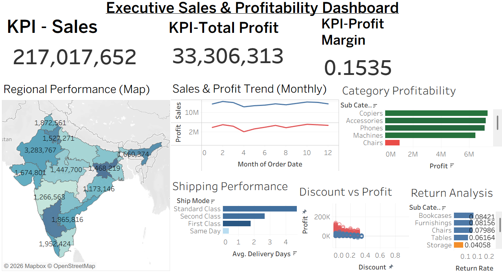
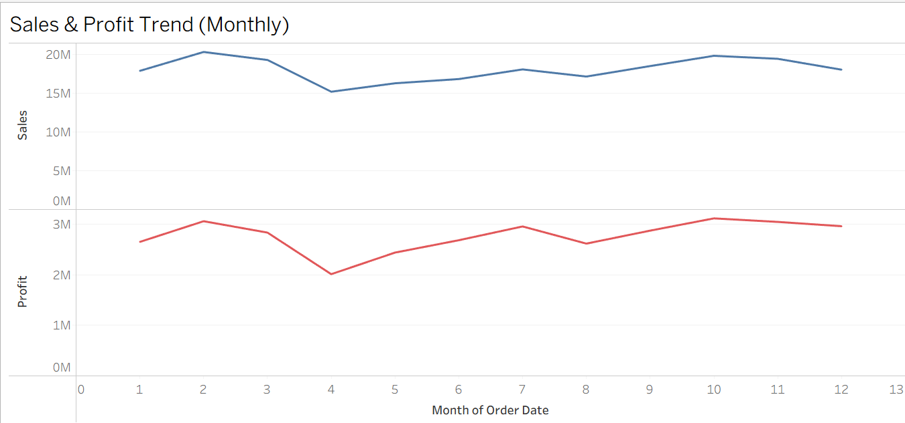
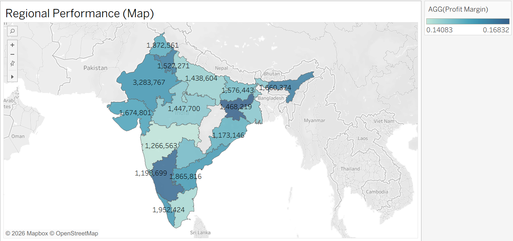
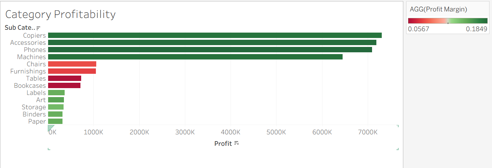
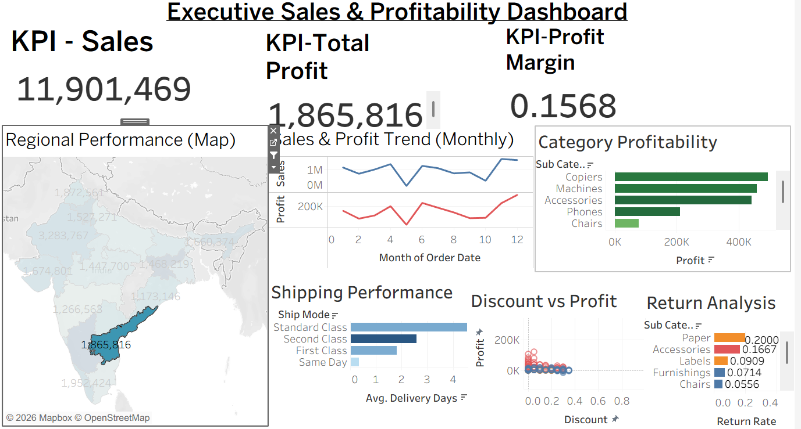

# Executive Sales Dashboard — Tableau Project

## Business Problem Summary
Retail leadership needs a single executive dashboard to monitor sales performance, profitability, customer segment behavior, category performance, shipping performance, discount impact, and return patterns — in order to identify business opportunities and risks quickly, without digging through raw data.

## Dataset Description
**File:** `data/dashboard_sales_data.xlsx` (sheet: `dashboard_sales_data`, plus a `data_dictionary` sheet)
**Size:** 4,200 orders | **Period:** Jan 1, 2024 – Dec 31, 2025

| Field | Type | Notes |
|---|---|---|
| order_id, customer_id | String | Identifiers |
| order_date, ship_date | Date | Used to derive delivery delay and time trend |
| customer_segment | String | Consumer / Corporate / Home Office |
| region, state, city | Geographic | region has 4 values (North/South/East/West); state/city support map views |
| category, sub_category, product_name | Categorical | category has 3 values; 13 sub-categories |
| ship_mode | Categorical | Same Day / First Class / Second Class / Standard Class |
| sales, profit | Numeric (currency) | Order-level sales and profit |
| quantity | Numeric | Units per order |
| discount | Numeric (0–1) | Discount rate applied |
| return_flag | Binary (0/1) | 1 = order was returned |
| delivery_days | Numeric | `ship_date - order_date`, already provided in source |
| customer_rating | Numeric (1–5) | 32 nulls (~0.8%) — excluded from rating averages via Tableau's default null handling |
| campaign_channel | Categorical | Organic/Social/Referral/Paid/Email; 24 nulls (~0.6%) — excluded from channel-level totals |

**Assumptions made:**
- `delivery_days` in the source is treated as already-correct (ship_date minus order_date); it was not recalculated.
- Nulls in `customer_rating` and `campaign_channel` are excluded (not imputed) from their respective aggregations, consistent with Tableau's default behavior for null dimension/measure values.
- Currency is assumed to be Indian Rupees (₹) based on state names (Rajasthan, Telangana, Tamil Nadu, etc.) in the data; no explicit currency field exists.
- "Orders" and "rows" are treated as equivalent (one row = one order) for rate calculations (return rate, AOV), since the data has no separate order-line-item granularity.

## Tableau Workbook Description
`tableau/executive_dashboard.twbx` is a packaged workbook built from `dashboard_sales_data.xlsx`, containing one calculated-field set, the required individual sheets, and one combined executive dashboard. *(Build steps below — this repository ships the data and full written deliverables; finishing the workbook in Tableau Desktop takes the steps in the "Tableau Build Guide" section.)*

## Calculated Fields
| Field | Formula | Logic |
|---|---|---|
| **Profit Margin** | `SUM([Profit]) / SUM([Sales])` | Profit ÷ Sales, aggregated (avoids divide-by-zero issues better than row-level division when used in views) |
| **Cost** | `[Sales] - [Profit]` | Sales minus profit |
| **Average Order Value** | `SUM([Sales]) / COUNTD([Order ID])` | Sales ÷ distinct order count |
| **Return Rate** | `SUM([Return Flag]) / COUNTD([Order ID])` | Returned orders ÷ total orders |
| **Shipping Delay Bucket** | see formula below | Buckets `delivery_days` into 4 meaningful groups |
| **Discount Bucket** *(extra)* | see formula below | Buckets discount rate into 4 groups for the discount-vs-profit view |

**Shipping Delay Bucket formula:**
```
IF [Delivery Days] <= 2 THEN "0-2 days (Fast)"
ELSEIF [Delivery Days] <= 4 THEN "3-4 days (Standard)"
ELSEIF [Delivery Days] <= 6 THEN "5-6 days (Slow)"
ELSE "7+ days (Delayed)"
END
```

**Discount Bucket formula (extra field):**
```
IF [Discount] <= 0.05 THEN "0-5%"
ELSEIF [Discount] <= 0.15 THEN "5-15%"
ELSEIF [Discount] <= 0.25 THEN "15-25%"
ELSE "25%+"
END
```

## Dashboard Components
- **Title:** "Executive Sales & Profitability Dashboard"
- **KPI cards (3+):** Total Sales, Total Profit, Profit Margin, Return Rate (pick 3–4)
- **Charts (5+):** Sales Trend (line), Regional Performance (map + bar), Category Profitability (bar), Customer Segment (highlight table), Discount vs Profit (scatter), Shipping Performance (bar), Return Analysis (bar) — see `outputs/chart_selection_justification.md` for the full rationale on each.

## Filters and Interactions Used
- **Filters:** Region, Category, Customer Segment, Date Range (order_date), Ship Mode
- **Action/filter interaction:** Clicking a region on the map filters all other sheets on the dashboard to that region (dashboard action: Filter, source = Regional Performance map, target = all other sheets)

## Key Business Insights
See `outputs/business_insights.md` for the full 8-insight write-up. Headlines:
- Technology drives 18.2% margin and the majority of company profit; Furniture lags at 6.9% margin.
- Discount depth above 25% drops margin to ~6.5%, down from ~20% at low discount.
- Furniture sub-categories (Bookcases, Furnishings, Chairs) are simultaneously the lowest-margin and highest-return items — one root-cause investigation likely fixes both problems.
- Home Office segment returns at 5.7% vs. ~4% for other segments despite similar spend.
- Delivery delay does **not** strongly predict returns (return rate stays in a 4.2–4.9% band regardless of delay) — shipping speed is not the lever to pull for return reduction.

## Dashboard Story Summary
See `outputs/dashboard_story.md`. In short: sales are seasonally stable, not declining; profitability is being shaped by category mix (Technology vs. Furniture) and discount discipline far more than by sales volume or shipping performance. The clearest, most actionable opportunity is the Furniture/return cluster, since it shows up as a risk in two metrics at once (margin and returns).

## Assumptions and Limitations
- Two-year dataset only; no pre-2024 baseline for longer-term trend comparison.
- No fixed-cost/overhead or marketing-spend-by-channel data, so "channel profit" is gross order profit, not fully-loaded ROI.
- No return-reason field — the data shows *where* returns concentrate, not *why*.
- Small amounts of missing data in `customer_rating` (0.8%) and `campaign_channel` (0.6%), excluded rather than imputed.

## Screenshots Included

### Full Dashboard


### Sales Trend


### Regional Performance


### Category Profitability


### Filter Interaction

